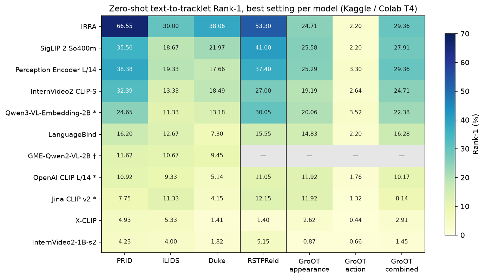
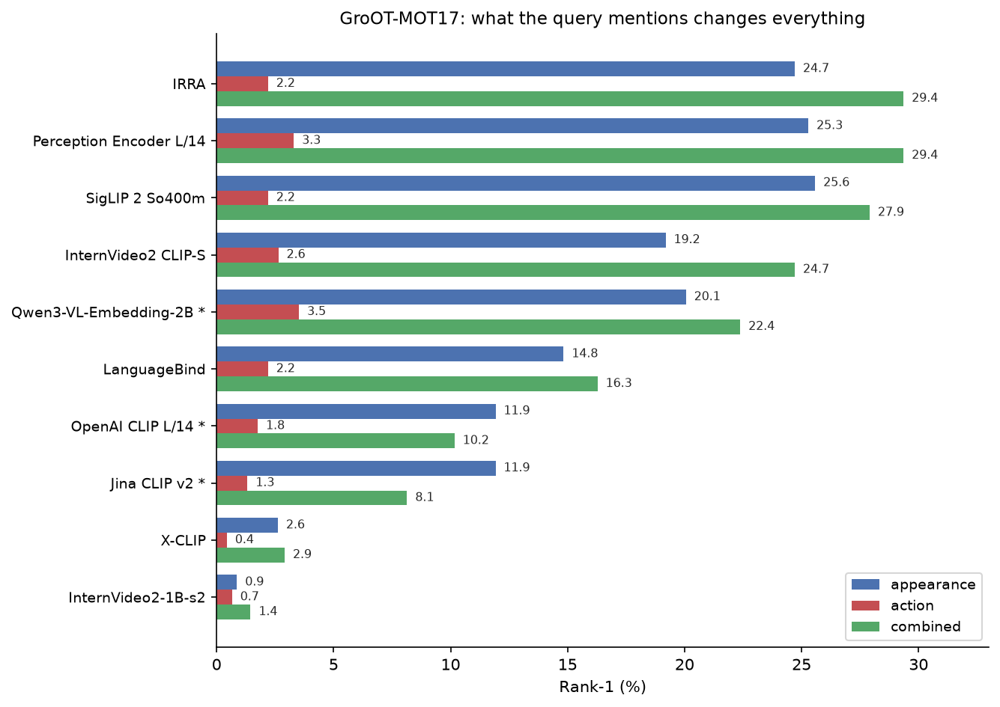
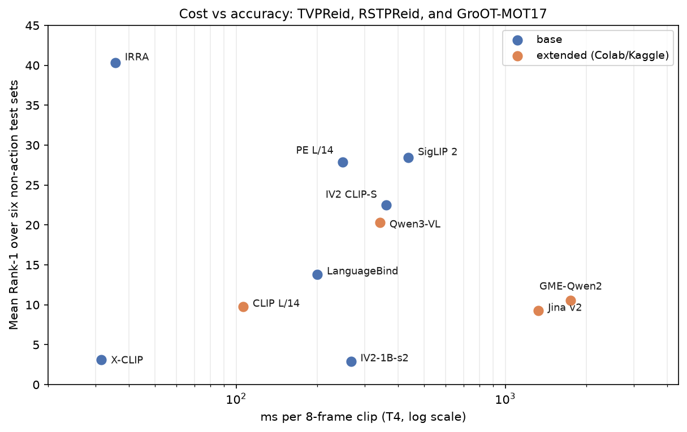

# SHAWAF: text-to-tracklet retrieval

SHAWAF is a Stage 1 benchmark for **text-to-tracklet retrieval**. A frozen
vision-language model embeds a text description and each video tracklet; cosine
similarity ranks the gallery.

```text
text description ──► text encoder ──► text embedding
                                      │ cosine similarity
tracklet ──────────► video/image encoder ──► tracklet embedding ──► ranked gallery
```

This repository does **not** fuse VLM and Re-ID features, train a projection
into the VLM space, or use Qdrant. Those are later SHAWAF stages. The identity
encoder remains in the sibling `Person-ReID-BenchMark` project.

## Executive summary

All results below are frozen, zero-shot evaluations: no model was fine-tuned on
the target benchmark. Values are **Rank-1 / mAP** unless stated otherwise.

| Question | Best result | Interpretation |
|---|---|---|
| Person descriptions on video tracklets (TVPReid) | **IRRA**: 66.55 / 76.09 on PRID | Task-specific text-to-person training transfers best to identity descriptions. |
| Person descriptions on still images (RSTPReid) | **IRRA**: 53.30 / 39.71 | The same task-specific advantage survives without temporal information. |
| Clothing-based street-track retrieval (GroOT appearance) | **SigLIP 2**: 25.58 | Appearance is discriminative; broad image-language pretraining is competitive. |
| Long-video event retrieval (ActivityNet paragraph) | **InternVideo2 CLIP-S**: 69.80 / 80.24 | Video-language pretraining and temporal coverage matter for whole events. |
| Long-video event retrieval (ActivityNet sentence) | **Perception Encoder**: 41.91 / 54.83 | Frame-level semantic alignment is strongest for short event descriptions. |
| Best extended model on TVPReid | **Qwen3-VL-Embedding-2B**: 24.65 / 37.00 on PRID | Newer general embeddings help, but still do not beat task-specific IRRA. |

### Practical model recommendations

- **Use IRRA for person-search descriptions.** It is the clear TVPReid and
  RSTPReid winner and is also among the most efficient accurate choices.
- **Use Perception Encoder for a balanced general-purpose baseline.** It is
  the best ActivityNet sentence model, wins ActivityNet on mean Rank-1, and is
  the strongest general model on GroOT combined captions.
- **Use InternVideo2 CLIP-S for long videos and paragraph-level events.** It
  is the ActivityNet paragraph winner; its video pretraining is useful when
  the query describes several events over time.
- **Use SigLIP 2 when image/appearance evidence dominates.** It is the
  strongest RSTPReid general model and the best GroOT appearance model.
- **Use Qwen3-VL-Embedding-2B as the most promising extended model.** It is
  substantially better than the other extended models on TVPReid, especially
  PRID, but it is slower and heavier than IRRA.
- **Avoid choosing a model from speed alone.** X-CLIP is fast but consistently
  weak on retrieval quality; GME-Qwen2-VL-2B is expensive and does not close
  the gap to the task-specific baselines.

## Benchmark results

### TVPReid: person descriptions and video tracklets

Each cell is the best Rank-1 / mAP for that model on the indicated test subset.
The gallery sizes are PRID 185, iLIDS 75, and Duke 603 tracklets.

| Model | PRID | iLIDS | Duke |
|---|---:|---:|---:|
| **IRRA** | **66.55 / 76.09** | **30.00 / 41.29** | **38.06 / 50.79** |
| SigLIP 2 So400m | 35.56 / 50.84 | 18.67 / 28.88 | 21.97 / 33.03 |
| Perception Encoder L/14 | 38.38 / 52.04 | 19.33 / 32.55 | 17.66 / 28.12 |
| InternVideo2 CLIP-S | 32.39 / 43.77 | 13.33 / 24.14 | 18.49 / 28.36 |
| Qwen3-VL-Embedding-2B | 24.65 / 37.00 | 11.33 / 21.37 | 13.18 / 22.73 |
| LanguageBind | 16.20 / 24.82 | 12.67 / 22.09 | 7.30 / 14.46 |
| GME-Qwen2-VL-2B | 11.62 / 22.96 | 10.67 / 20.14 | 9.45 / 17.70 |
| OpenAI CLIP ViT-L/14 | 10.92 / 20.05 | 9.33 / 17.48 | 5.14 / 10.10 |
| Jina CLIP v2 | 7.75 / 14.41 | 11.33 / 19.47 | 4.15 / 9.80 |
| X-CLIP | 4.93 / 10.05 | 5.33 / 10.52 | 1.41 / 3.95 |
| InternVideo2-1B-s2 | 4.23 / 10.78 | 4.00 / 10.26 | 1.82 / 4.15 |

**Why the gap?** IRRA was trained for text-to-person retrieval, so its
embedding space is aligned with clothing, body, and identity descriptions.
General video-language models learn events and actions rather than fine-grained
person identity. Qwen3 is the strongest of the newer general encoders, but
specialization still matters more than parameter count.



### RSTPReid: person descriptions and still images

This is an image-only check: 2,000 descriptions query 1,000 images from 200
identities.

| Model | Rank-1 / mAP |
|---|---:|
| **IRRA** | **53.30 / 39.71** |
| SigLIP 2 So400m | 41.00 / 29.34 |
| Perception Encoder L/14 | 37.40 / 29.09 |
| Qwen3-VL-Embedding-2B | 30.05 / 21.72 |
| InternVideo2 CLIP-S | 27.00 / 21.34 |
| LanguageBind | 15.55 / 11.36 |
| Jina CLIP v2 | 12.15 / 9.64 |
| OpenAI CLIP ViT-L/14 | 11.05 / 8.21 |
| InternVideo2-1B-s2 | 5.15 / 4.53 |
| X-CLIP | 1.40 / 2.26 |

The ordering supports the TVPReid conclusion: image-language pretraining helps
more than video pretraining when there is no temporal signal, but task-specific
person retrieval remains the strongest prior.

### GroOT-MOT17: appearance versus action

The same 454 street tracks are queried using appearance descriptions, action
descriptions, and a cleaned sentence containing both.

| Model | Appearance | Action | Combined |
|---|---:|---:|---:|
| Perception Encoder L/14 | 25.29 | 3.30 | **29.36** |
| IRRA | 24.71 | 2.20 | **29.36** |
| **SigLIP 2 So400m** | **25.58** | 2.20 | 27.91 |
| InternVideo2 CLIP-S | 19.19 | 2.64 | 24.71 |
| Qwen3-VL-Embedding-2B | 20.06 | **3.52** | 22.38 |
| LanguageBind | 14.83 | 2.20 | 16.28 |
| OpenAI CLIP ViT-L/14 | 11.92 | 1.76 | 10.17 |
| Jina CLIP v2 | 11.92 | 1.32 | 8.14 |
| X-CLIP | 2.62 | 0.44 | 2.91 |
| InternVideo2-1B-s2 | 0.87 | 0.66 | 1.45 |

Action Rank-1 is only 0.44–3.52 because the action captions are highly
repetitive: only 112 of 454 are unique, and “a person walking on the street”
alone matches 78 tracks. This is primarily a dataset/caption ceiling, not a
model failure. Appearance is discriminative; combining appearance and action
improves both leading models. The reviewed combined captions are stored in
[`shawaf_vlm/data/groot_mot17_combined.json`](shawaf_vlm/data/groot_mot17_combined.json).



### ActivityNet Captions: general long-video events

This out-of-domain check uses a seeded sample of 1,000 `val1` videos
(`ANET_SEED=0`, about 180 seconds per video). `paragraph` joins a video's event
sentences; `sentence` queries individual events. Only the seven base models
were evaluated.

| Model | Paragraph | Sentence | Mean Rank-1 |
|---|---:|---:|---:|
| Perception Encoder L/14 | 68.10 / 78.87 | **41.91 / 54.83** | **55.01** |
| InternVideo2 CLIP-S | **69.80 / 80.24** | 39.73 / 52.87 | 54.76 |
| LanguageBind | 64.10 / 75.18 | 36.96 / 49.82 | 50.53 |
| SigLIP 2 So400m | 57.10 / 70.18 | 35.11 / 48.51 | 46.11 |
| InternVideo2-1B-s2 | 37.70 / 48.77 | 10.62 / 15.48 | 24.16 |
| X-CLIP | 28.60 / 41.53 | 14.04 / 23.59 | 21.32 |
| IRRA | 16.40 / 27.20 | 8.29 / 15.40 | 12.35 |

The ranking reverses relative to person retrieval: video-pretrained encoders
transfer better to general events, while IRRA's person-specific training does
not. Dense temporal sampling helps sentence queries because one window can
match the queried event; mean pooling is safer for paragraphs.

> These are not published ActivityNet numbers. They use a 1,000-video sample
> and frozen encoders rather than an ActivityNet-trained retrieval model.

## Scope and reproducibility

### Evaluation protocol

- Frozen encoders, cosine similarity, L2-normalized embeddings.
- Default clip: 8 frames at 224x224.
- Reported headline values select the best tested temporal protocol and pool.
- Available protocols: `uniform8`, `vt_1fps_n12`, `vt_2fps_n32`, and
  `reid_8fps_n64`.
- Available pools: `mean`, `mean_s8`, `max`, and `query_max`.
- `query_max` is this repository's late-interaction diagnostic; it is not the
  official X-Pool implementation.

### Cost versus accuracy



This figure belongs to the **TVPReid + RSTPReid + GroOT-MOT17** experiments,
not ActivityNet. Each point is one frozen model. The x-axis is the measured
time to encode one 8-frame clip on a T4; the y-axis is mean Rank-1 across the
six available non-action test sets: TVPReid PRID, iLIDS, and Duke; RSTPReid;
and GroOT-MOT17 appearance and combined queries. GroOT action is excluded
because its highly repetitive captions create a dataset ceiling rather than a
meaningful model comparison. Timings were collected in the benchmark runs and
are hardware/runtime-specific, so the chart is a practical trade-off view, not
a universal speed ranking.

The extended checkpoint contains all **156 completed configurations** for
OpenAI CLIP ViT-L/14, Jina CLIP v2, GME-Qwen2-VL-2B, and
Qwen3-VL-Embedding-2B across PRID, iLIDS, and Duke:
[`results/checkpoints/extended_zero_shot_4models_3datasets_v1.csv`](results/checkpoints/extended_zero_shot_4models_3datasets_v1.csv).

### Repository layout

| Path | Purpose |
|---|---|
| [`shawaf_vlm/`](shawaf_vlm/) | Encoders, dataset loaders, sampling, pooling, metrics, and evaluation loop |
| [`scripts/eval_encoder.py`](scripts/eval_encoder.py) | Command-line evaluation entry point |
| [`scripts/build_groot_mot17.py`](scripts/build_groot_mot17.py) | Build the GroOT-MOT17 metadata |
| [`notebooks/`](notebooks/) | Executed Kaggle/Colab experiment notebooks |
| [`tests/`](tests/) | Dataset, model, and evaluation tests |
| [`assets/`](assets/) | Report figures |
| [`papers/`](papers/) | Reference papers |

Large datasets, model caches, generated frames, checkpoints, `build/`,
`results/` outputs, and notebook checkpoint folders are intentionally ignored
by Git. The tracked extended CSV is the exception: it is the compact,
reviewable experiment checkpoint.

### Install

Python 3.10+ is required. Install the common environment or a model-specific
extra:

```bash
pip install -e ".[all]"
# or: pip install -e ".[xclip]"
# or: pip install -e ".[extended_modern]"
# or: pip install -e ".[extended_gme]"
```

`extended_modern` uses Transformers 4.57.3 for OpenAI CLIP, Jina CLIP v2, and
Qwen3-VL-Embedding. `extended_gme` uses Transformers 4.51.3 and is kept
separate because the two profiles are not mutually compatible.

### Run an evaluation

```bash
python scripts/eval_encoder.py --model xclip --data-root "../Person-ReID-BenchMark/datasets/MARS" --ann-root "/path/to/tv-mars-captions" --device cuda
```

For sliding windows and pooling:

```bash
python scripts/eval_encoder.py --model languagebind --windows --stride 4 --sample-fps 2 --max-frames 32 --pools mean,mean_s8,max,query_max
```

The loaders also support the public dataset mirrors used by the notebooks:
[TVPReid](https://huggingface.co/datasets/bassatbassat/TVPReid),
[GroOT-MOT17](https://huggingface.co/datasets/bassatbassat/GroOT-MOT17),
and [ActivityNet Captions](https://huggingface.co/datasets/friedrichor/ActivityNet_Captions).
MSMT17/RSTPReid data is not redistributed here.

### Notebooks

- [`notebooks/kaggle-zero-shot.ipynb`](notebooks/kaggle-zero-shot.ipynb):
  multi-dataset zero-shot benchmark.
- [`notebooks/colab_extended_zero_shot.ipynb`](notebooks/colab_extended_zero_shot.ipynb):
  extended-model TVPReid checkpoint.
- [`notebooks/activity-net-siglip-irra-xclip-perception.ipynb`](notebooks/activity-net-siglip-irra-xclip-perception.ipynb):
  ActivityNet base models, first group.
- [`notebooks/activity-net-languagebind-internvideo.ipynb`](notebooks/activity-net-languagebind-internvideo.ipynb):
  ActivityNet base models, second group.
- [`notebooks/kaggle_finetuning.ipynb`](notebooks/kaggle_finetuning.ipynb):
  exploratory InternVideo2 fine-tuning; it is not part of the frozen tables.

Dataset-specific paths can be overridden with
`SHAWAF_TVPREID_ROOT`, `SHAWAF_RSTPREID_ROOT`, `SHAWAF_GROOT_ROOT`,
`SHAWAF_MARS_ROOT`, and `SHAWAF_TV_MARS_ANN`.

## Limitations

- Results are zero-shot and depend on the selected checkpoint, GPU runtime,
  frame sampling, and pool. They are not claims about fine-tuned performance.
- ActivityNet uses a 1,000-video sample, so it should be treated as a transfer
  diagnostic rather than a direct comparison with published benchmarks.
- GroOT action captions are not sufficiently diverse for a strong action
  retrieval conclusion.
- Extended models were not evaluated on every dataset; the extended CSV covers
  TVPReid only.
- The TV-MARS captions are gated. Follow the dataset agreement rather than
  committing the data to this repository.

## License

See [`LICENSE`](LICENSE). Dataset and checkpoint licenses remain those of their
original providers.
